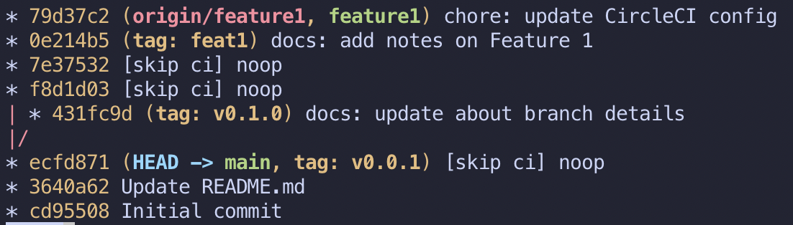

# Git Tags, Explored

This is a sample repo that explores how Git tags can be accessed from CircleCI builds.

```sh
git log --graph --oneline --all
```



As you can see from the Git tree of our repository,
there are 3 tags in this project.

- `v0.0.1` (earliest tag, tagged in main branch)
- `v0.1.0` (2nd tag, tagged in development branch that branched out from main)
- `feat1` (3rd tag, tagged in feature1 branch that branched out from main)

You can see if the CI build for our `feature1` branch that all 3 tags are still available **if** we use the following command:

```sh
git tag -l

# git describe --tags
# will only show the latest tag in this BRANCH
```

Note that this includes the `v0.1.0` tag even though this was a tag on another branch, `development`.
